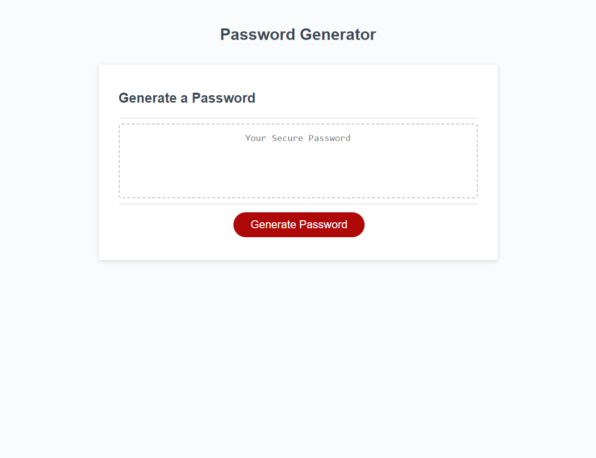

# employee-password-generator
employee-password-generator

## Link to Application
https://dan-watkins.github.io/employee-password-generator/ 

## Description
This webpage allows you to generate a random password using a variety of character types of your choosing. The input is between 8 and 128 characters and must include at least 1 selection of available types to generate the password.

Supports the following character types:

* Numbers

* Lowercase

* Uppercase

* Special Characters

## Installation
Simply clone the repository. The current project is deployed using GitHub pages, which you will need to do as well.

* In the Settings for your respoitory scroll down to the 'Code and automation' section and find 'Pages.'

* Branch should be 'main.' Save.

* This step may take a moment to generate the page URL. Be patient.

* Once Page build and deploy is complete you should be able to access the site via <your-github-username.github.io/your-repository-name>.

## Credits
Special thanks to Nick Shulte for suggestions on code readability while helping me keep the main functionality intact.